 

**I turn data and models into useful applications.** 
LLMs & retrieval · Machine learning · Full-stack engineering

[LinkedIn](https://www.linkedin.com/in/oussama-oulkaid-820301209/) &nbsp; / &nbsp; [Email](mailto:oussama.is.loading@gmail.com) &nbsp; / &nbsp; [Explore my repositories](https://github.com/deleted04user?tab=repositories)

 

<table>
<tr>
<td width="40%" valign="top"></td>
<td width="60%" valign="top"></td>
</tr>
</table>

### `~/projects $ ls --featured`

<table>
<tr>
<td width="50%" valign="top">

**01 / [MoroccoLaw-LLM](https://github.com/deleted04user/MoroccoLaw-LLM)**

An educational RAG prototype for Moroccan legal documents: multilingual retrieval and answers grounded in source passages.

`Python` `Qwen` `FAISS` `Transformers`

</td>
<td width="50%" valign="top">

**02 / [Electricity Demand Forecasting](https://github.com/deleted04user/electricity-demand-forecasting)**

A forecasting portfolio project using synthetic demo data, leakage-safe evaluation, an API, and a React analytics dashboard.

`XGBoost` `FastAPI` `React` `Python`

</td>
</tr>
<tr>
<td width="50%" valign="top">

**03 / [University RAG Assistant](https://github.com/deleted04user/university-rag-assistant)**

A university portal with role-based access, academic management, and a fully local TF-IDF retrieval assistant.

`FastAPI` `JWT` `Python` `TF-IDF`

</td>
<td width="50%" valign="top">

**04 / [LUMA](https://github.com/deleted04user/LUMA)**

An accessible image discovery interface with search filters, themes, and clear loading and error states.

`JavaScript` `HTML` `CSS` `Unsplash API`

</td>
</tr>
</table>

Also exploring **[deep learning architectures](https://github.com/deleted04user/deep-learning-architectures)**, **[systems in C](https://github.com/deleted04user/BMS)**, and **[embedded security](https://github.com/deleted04user/arduino_smartHome)**.

### `~/stack $ cat toolkit.txt`

| Area | Toolkit |
| :--- | :--- |
| AI & data | Python · Pandas · NumPy · scikit-learn · XGBoost · PyTorch · Transformers · FAISS |
| Applications | FastAPI · React · JavaScript · REST APIs · HTML · CSS |
| Databases | PostgreSQL · MySQL · SQL Server · SQLite |
| Engineering | Git · GitHub Actions · Docker · Linux · UML |
| Systems & embedded | C · C++ · Arduino |

### `~/activity $ contributions --last-year`

### `~/next $ cat focus.md`

I'm improving multilingual RAG, time-series forecasting, and end-to-end AI applications. I care about traceable sources, reproducible evaluation, clean architecture, and interfaces people can use.

**Open to AI/ML, data, software engineering, and end-of-study internship opportunities.**

 

**Have a useful problem to solve? Let's build.**

[Connect on LinkedIn](https://www.linkedin.com/in/oussama-oulkaid-820301209/) &nbsp; / &nbsp; [Get in touch](mailto:oussama.is.loading@gmail.com)

About this profile

The portrait and info card are self-contained SVGs with one-time reveal animations. The calendar uses real public GitHub contribution data and refreshes daily through [GitHub Actions](https://github.com/deleted04user/deleted04user/actions/workflows/update-profile-art.yml). Reduced-motion preferences disable CSS reveals; every image also has a readable final frame and descriptive alternative text.

The daily update uses Python's standard library and the public contribution endpoint; no personal access token or external stats service is needed. If GitHub changes its calendar markup, validation stops the refresh and preserves the last published art.

To regenerate the calendar: `python scripts/profile_art.py --refresh`. To update the identity card after editing its content: `python scripts/profile_art.py --identity`. Portrait conversion additionally needs Pillow and a local copy of the current avatar: `python scripts/profile_art.py --portrait path/to/avatar.png`.

Inspired by [Avi Vashishta's animated profile guide](https://www.avivashishta.com/blog/build-animated-github-profile-readme). Profile design and generators are written for this account.

